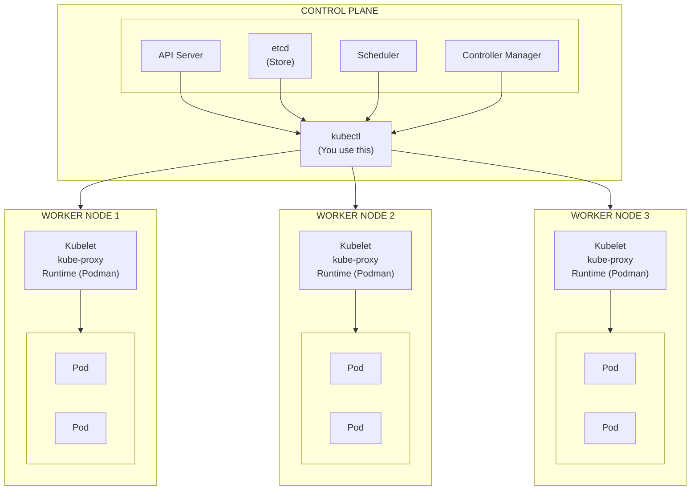
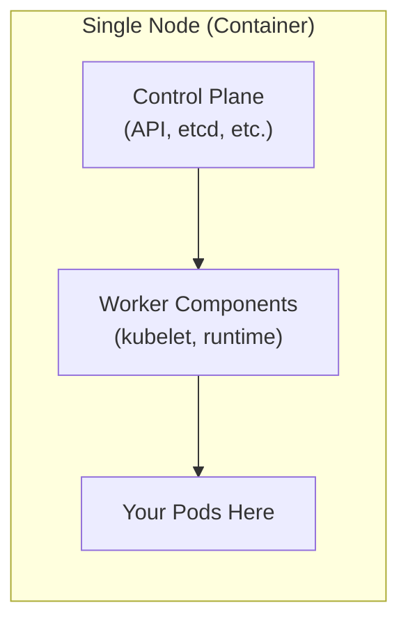
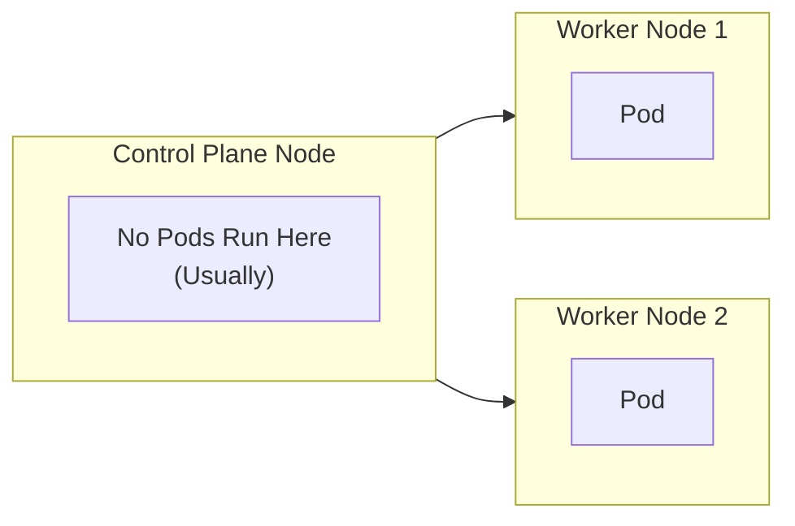

# Introduction to Kubernetes

**Duration:** 30 minutes

## Learning Objectives

- Understand what Kubernetes is and why it exists
- Learn the key differences between Docker Compose and Kubernetes
- Understand Kubernetes architecture components
- Distinguish between single-node and multi-node clusters

## What is Kubernetes?

**Kubernetes** (K8s) is an open-source container orchestration platform that automates the deployment, scaling, and management of containerized applications.

### The Evolution

Bare Metal → VMs → Containers → Container Orchestration → Kubernetes

### Why Kubernetes?

Docker Compose is great for development, but in production you need:

| Challenge               | Kubernetes Solution                           |
| ----------------------- | --------------------------------------------- |
| **Scaling**             | Automatic horizontal scaling                  |
| **High Availability**   | Self-healing, multiple replicas               |
| **Load Balancing**      | Built-in service discovery and load balancing |
| **Rolling Updates**     | Zero-downtime deployments                     |
| **Multi-Host**          | Cluster of machines, not just one host        |
| **Storage**             | Persistent volumes across hosts               |
| **Secrets Management**  | Encrypted secret storage                      |
| **Resource Management** | CPU/memory limits and requests                |

## Kubernetes Architecture

### 1. Control Plane (Master Node)

The "brain" of the cluster. Components:

#### **API Server** (`kube-apiserver`)

- Front-end for the Kubernetes control plane
- All communication goes through here
- Validates and processes REST requests
- **You interact with this when using `kubectl`**

#### **etcd**

- Distributed key-value store
- Stores all cluster data (configuration, state, metadata)
- The "source of truth" for the cluster
- **Think of it as Kubernetes' database**

#### **Scheduler** (`kube-scheduler`)

- Watches for new Pods with no assigned node
- Selects which node should run the Pod
- Considers: resources, constraints, affinity rules
- **Decides "where" Pods run**

#### **Controller Manager** (`kube-controller-manager`)

- Runs controller processes
- Node Controller: Monitors node health
- Replication Controller: Maintains correct number of Pods
- Endpoints Controller: Populates Endpoints objects
- **Ensures "desired state" matches "actual state"**

### 2. Worker Nodes

Where your applications actually run. Components:

#### **Kubelet**

- Agent running on each node
- Ensures containers are running in Pods
- Reports node and Pod status to API server
- **The "node manager"**

#### **Container Runtime**

- Software that runs containers (Docker, containerd, CRI-O, **Podman**)
- Pulls images, starts/stops containers
- **What actually runs your apps**

#### **kube-proxy**

- Network proxy on each node
- Maintains network rules
- Enables Service abstraction
- **Handles Pod-to-Pod and external-to-Pod networking**

### Architecture Diagram



## Single-Node vs Multi-Node Clusters

### Single-Node Setup



**Good for:**

- Development and learning
- CI/CD testing
- Local experimentation

**Limitations:**

- No high availability
- Can't test multi-node features
- Resource constrained

### Multi-Node Setup



**Good for:**

- Production deployments
- High availability
- Testing affinity/anti-affinity
- Realistic scenarios

## Kubernetes vs Docker Compose

### Conceptual Comparison

| Docker Compose       | Kubernetes              | Key Difference              |
| -------------------- | ----------------------- | --------------------------- |
| Single host          | Multi-host cluster      | Scale                       |
| `docker-compose.yml` | Multiple YAML manifests | Complexity                  |
| Services             | Services + Deployments  | Abstraction layers          |
| Volumes              | PersistentVolumes       | Network-attached storage    |
| Networks             | Services + CNI          | Automatic service discovery |
| `docker-compose up`  | `kubectl apply`         | Declarative                 |
| Manual scaling       | Auto-scaling            | Intelligence                |

### Example: The Same App

**Docker Compose:**

```yaml
version: '3'
services:
  web:
    image: nginx:latest
    ports:
      - "8080:80"
    replicas: 3
    environment:
      - ENV=production
```

**Kubernetes (Simplified):**

```yaml
# Deployment (manages Pods)
apiVersion: apps/v1
kind: Deployment
metadata:
  name: web
spec:
  replicas: 3
  selector:
    matchLabels:
      app: web
  template:
    metadata:
      labels:
        app: web
    spec:
      containers:
        - name: nginx
          image: nginx:latest
          env:
            - name: ENV
              value: "production"
---
# Service (exposes Pods)
apiVersion: v1
kind: Service
metadata:
  name: web
spec:
  selector:
    app: web
  ports:
    - port: 80
      targetPort: 80
  type: LoadBalancer
```

**Key Differences:**

1. **More verbose** - Kubernetes is more explicit
2. **Separation of concerns** - Deployment + Service (not one definition)
3. **Labels** - Used for selection and organization
4. **More control** - More configuration options

## Kubernetes Philosophy

### Declarative, Not Imperative

**Imperative (Docker Compose-like):**

```bash
# You tell it HOW to do things
docker-compose up --scale web=3
docker-compose restart web
```

**Declarative (Kubernetes way):**

```bash
# You tell it WHAT you want, it figures out HOW
kubectl apply -f deployment.yaml
# (deployment.yaml says: replicas: 3)

# Kubernetes ensures this state is maintained
# - If a Pod dies, it creates a new one
# - If a node fails, it reschedules Pods elsewhere
```

### Desired State vs Actual State

```text
You declare:             Kubernetes ensures:
"I want 3 Pods"    →→→   3 Pods always running

1 Pod crashes?     →→→   Kubernetes creates a new one
Node fails?        →→→   Kubernetes moves Pods to healthy nodes
```

This is the **reconciliation loop** - controllers constantly work to match actual state to desired state.

## Key Kubernetes Concepts (Preview)

We'll dive deep into these in upcoming sections:

| Concept        | Purpose                                  | Docker Compose Equivalent |
| -------------- | ---------------------------------------- | ------------------------- |
| **Pod**        | Smallest deployable unit (1+ containers) | Service container         |
| **Deployment** | Manages Pod replicas, updates            | Service with replicas     |
| **Service**    | Stable network endpoint for Pods         | Service ports + networks  |
| **ConfigMap**  | Configuration data                       | Environment variables     |
| **Secret**     | Sensitive data                           | Secrets (but better)      |
| **Volume**     | Storage                                  | Volumes                   |
| **Namespace**  | Logical cluster separation               | Projects/stacks           |

## When to Use What?

### Use Docker Compose When

- Local development
- Simple applications
- Single machine is enough
- Quick prototyping
- Small team

### Use Kubernetes When

- Production at scale
- Need high availability
- Multiple environments (dev, staging, prod)
- Complex microservices
- Multi-team organization
- Cloud-native applications

### The Reality

Many teams use **both**:

- Docker Compose for local dev
- Kubernetes for production

## Quick Demo

Let's see Kubernetes in action:

```bash
# Create a cluster (if not already done)
kind create cluster --config /workspaces/compose-to-kubernetes/setup/kind/simple.yaml

# Check cluster health
kubectl get nodes

# Deploy nginx
kubectl create deployment nginx --image=nginx:latest

# Check it out
kubectl get deployments
kubectl get pods

# Expose it
kubectl expose deployment nginx --port=80 --type=NodePort

# Scale it
kubectl scale deployment nginx --replicas=3

# Watch the magic
kubectl get pods -w

# Clean up
kubectl delete deployment nginx
kubectl delete service nginx

# Clean up of the cluster
kind delete cluster --name workshop
```

## Check Your Understanding

Before moving on, make sure you can answer:

1. What are the four main components of the Control Plane?
2. What runs on each Worker Node?
3. What's the key philosophical difference between Docker Compose and Kubernetes?
4. What does "declarative" mean in the Kubernetes context?
5. When would you choose Kubernetes over Docker Compose?

<details class="solution" markdown="1">
<summary>Solution</summary>

1. **API Server, etcd, Scheduler, Controller Manager**
2. **Kubelet, Container Runtime, kube-proxy**
3. **Docker Compose is imperative and single-host; Kubernetes is declarative and multi-host with self-healing**
4. **You declare the desired state, Kubernetes figures out how to achieve it**
5. **When you need production scale, HA, multi-host, auto-scaling, or complex orchestration**

</details>

## Next Section

Now that you understand the "why" and "what" of Kubernetes, let's get hands-on!

**Next:** [2. Environment Setup & First Steps](../02-environment/README.md)

## Further Reading

- [Official Kubernetes Documentation](https://kubernetes.io/docs/concepts/)
- [Kubernetes Architecture](https://kubernetes.io/docs/concepts/architecture/)
- [Kubernetes Components](https://kubernetes.io/docs/concepts/overview/components/)
